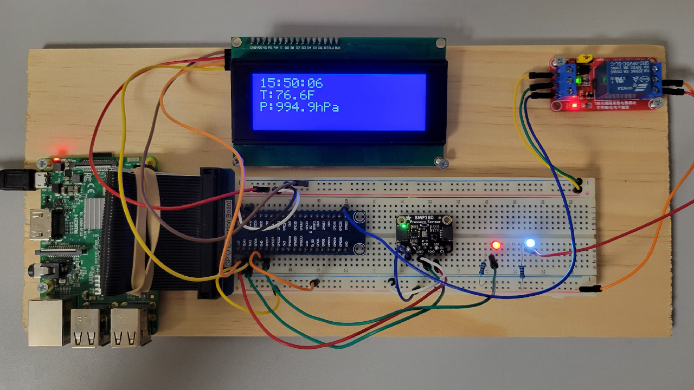

# RTDMS

RTDMS (Remote Datacenter Temperature Management System) demonstration using mentor Mike Corley's [VICEROY RTDMS tutorial](https://github.com/mwcorley79/VICEROY_RTDMS).
The tutorial provided hardware setup instruction and driver skeleton code.

## Implementation

RTDMS uses a Raspberry Pi 3 B+ with a BMP280 Temperature/Pressure sensor to toggle an HVAC system when the temperature exceeds a set threshold.
The driver is written in C# with .NET 6.0 to interface with a Microsoft Azure IoT Hub and Function App.

When deployed to a properly configured Raspberry Pi, the RTDMS driver connects to Azure and begins polling the BMP280 sensor for environmental data.
The user is presented with a menu to display current temperature/pressure, toggle HVAC status, or start transmitting telemetry to Azure.
The connected LCD is also updated in two second intervals to notify in-person operators about the device status.

### Docker

The [Dockerfile](Dockerfile) includes the development environment build instructions for an image with .NET 6.0 SDK, Node.js, Azure CLI, and Azure Functions Core Tools preinstalled. This can be cloned directly into Docker Desktop to set up the environment.

## Internet of Things (IoT)

RTDMS transmits temperature/pressure telemetry to an Azure IoT Hub in user defined intervals.
These data point are then visible in a [web app](web-apps-node-iot-hub-data-visualization/README.md) hosted on the [cloud](https://hvac-visualizer-web-app.azurewebsites.net/).
Azure's serverless functionality abstracts much of this hosting from the user, making it easy to quickly deploy.
An IoT Hub Trigger built on Azure Functions is called whenever the IoT Hub receives a message. This function determines whether to toggle the HVAC relay, and sends a Cloud-to-Device message if it changes state. It then uses an [IFTTT webhook](https://ifttt.com/) to email an HVAC operator about the automatic change.

### Acknowledgement

Special thanks to Anthony Macera (AFRL), Cully Patch (Quanterion Solutions), and Mike Corley (Quanterion Solutions) for their mentorship during my time at the Griffiss Institute during Summer 2023.
